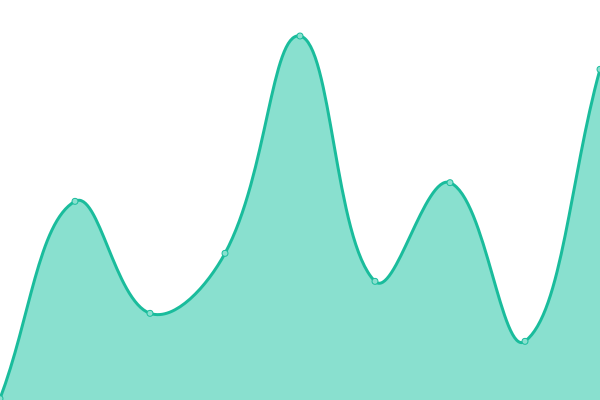
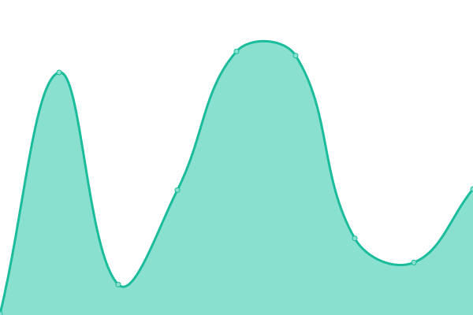
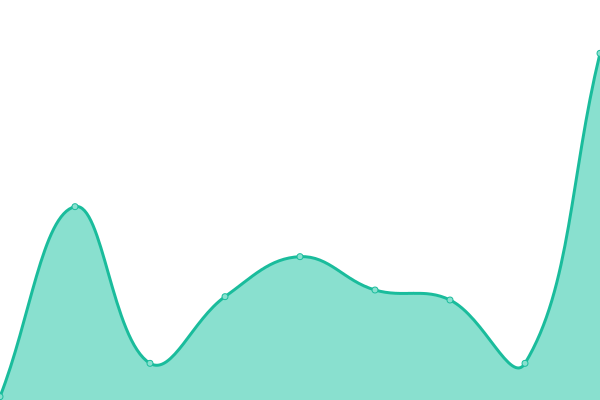
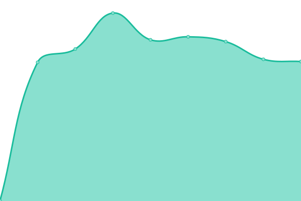

# [📈 Live Status](https://status.darwinia.network): <!--live status--> **🟩 All systems operational**

This repository contains the open-source uptime monitor and status page for [Upptime](https://upptime.js.org), powered by [Upptime](https://github.com/upptime/upptime).

With [Upptime](https://upptime.js.org), you can get your own unlimited and free uptime monitor and status page, powered entirely by a GitHub repository. We use [Issues](https://github.com/upptime/upptime/issues) as incident reports, [Actions](https://github.com/darwinia-network/upptime/actions) as uptime monitors, and [Pages](https://demo.upptime.js.org) for the status page.

<!--start: status pages-->
<!-- This summary is generated by Upptime (https://github.com/upptime/upptime) -->
<!-- Do not edit this manually, your changes will be overwritten -->
<!-- prettier-ignore -->
| URL | Status | History | Response Time | Uptime |
| --- | ------ | ------- | ------------- | ------ |
|  [rpc-darwinia-g1](http://g1.darwinia2.darwinia.network:9944) | 🟩 Up | [rpc-darwinia-g1.yml](https://github.com/darwinia-network/upptime/commits/HEAD/history/rpc-darwinia-g1.yml) | 

 510ms
     
 | 

<a href="https://status.darwinia.network/history/rpc-darwinia-g1">100.00%</a>
    

|  [rpc-darwinia-c1](http://c1.darwinia2.darwinia.network:9944) | 🟩 Up | [rpc-darwinia-c1.yml](https://github.com/darwinia-network/upptime/commits/HEAD/history/rpc-darwinia-c1.yml) | 

 425ms
     
 | 

<a href="https://status.darwinia.network/history/rpc-darwinia-c1">100.00%</a>
    

|  [rpc-darwinia-itering-c1](http://c1.darwinia-rpc.itering.io:9944) | 🟩 Up | [rpc-darwinia-itering-c1.yml](https://github.com/darwinia-network/upptime/commits/HEAD/history/rpc-darwinia-itering-c1.yml) | 

 407ms
     
 | 

<a href="https://status.darwinia.network/history/rpc-darwinia-itering-c1">78.44%</a>
    

|  [rpc-darwinia-itering-c2](http://c2.darwinia-rpc.itering.io:9944) | 🟩 Up | [rpc-darwinia-itering-c2.yml](https://github.com/darwinia-network/upptime/commits/HEAD/history/rpc-darwinia-itering-c2.yml) | 

 710ms
     
 | 

<a href="https://status.darwinia.network/history/rpc-darwinia-itering-c2">100.00%</a>
    

|  [rpc-darwinia-official](https://rpc.darwinia.network) | 🟩 Up | [rpc-darwinia-official.yml](https://github.com/darwinia-network/upptime/commits/HEAD/history/rpc-darwinia-official.yml) | 

 1396ms
     
 | 

<a href="https://status.darwinia.network/history/rpc-darwinia-official">100.00%</a>
    

|  [rpc-darwinia-dwellir](https://darwinia-rpc.dwellir.com) | 🟩 Up | [rpc-darwinia-dwellir.yml](https://github.com/darwinia-network/upptime/commits/HEAD/history/rpc-darwinia-dwellir.yml) | 

 509ms
     
 | 

<a href="https://status.darwinia.network/history/rpc-darwinia-dwellir">100.00%</a>
    

|  [rpc-darwinia-subquery](https://darwinia.rpc.subquery.network/public) | 🟩 Up | [rpc-darwinia-subquery.yml](https://github.com/darwinia-network/upptime/commits/HEAD/history/rpc-darwinia-subquery.yml) | 

 2189ms
     
 | 

<a href="https://status.darwinia.network/history/rpc-darwinia-subquery">98.98%</a>
    

|  [rpc-darwinia-dcdao](https://darwinia-rpc.dcdao.box) | 🟩 Up | [rpc-darwinia-dcdao.yml](https://github.com/darwinia-network/upptime/commits/HEAD/history/rpc-darwinia-dcdao.yml) | 

 629ms
     
 | 

<a href="https://status.darwinia.network/history/rpc-darwinia-dcdao">100.00%</a>
    

|  [rpc-darwinia-hrpc](https://hrpc.darwinia.network/darwinia) | 🟩 Up | [rpc-darwinia-hrpc.yml](https://github.com/darwinia-network/upptime/commits/HEAD/history/rpc-darwinia-hrpc.yml) | 

 615ms
     
 | 

<a href="https://status.darwinia.network/history/rpc-darwinia-hrpc">100.00%</a>
    

|  rpc-darwinia-collator-a | 🟩 Up | [rpc-darwinia-collator-a.yml](https://github.com/darwinia-network/upptime/commits/HEAD/history/rpc-darwinia-collator-a.yml) | 

 375ms
     
 | 

<a href="https://status.darwinia.network/history/rpc-darwinia-collator-a">100.00%</a>
    

|  rpc-darwinia-collator-b | 🟩 Up | [rpc-darwinia-collator-b.yml](https://github.com/darwinia-network/upptime/commits/HEAD/history/rpc-darwinia-collator-b.yml) | 

 339ms
     
 | 

<a href="https://status.darwinia.network/history/rpc-darwinia-collator-b">100.00%</a>
    

|  rpc-darwinia-collator-c | 🟩 Up | [rpc-darwinia-collator-c.yml](https://github.com/darwinia-network/upptime/commits/HEAD/history/rpc-darwinia-collator-c.yml) | 

 135ms
     
 | 

<a href="https://status.darwinia.network/history/rpc-darwinia-collator-c">100.00%</a>
    

|  rpc-darwinia-collator-d | 🟩 Up | [rpc-darwinia-collator-d.yml](https://github.com/darwinia-network/upptime/commits/HEAD/history/rpc-darwinia-collator-d.yml) | 

 187ms
     
 | 

<a href="https://status.darwinia.network/history/rpc-darwinia-collator-d">99.68%</a>
    

|  [rpc-crab-g1](http://g1.crab2.darwinia.network:9944) | 🟩 Up | [rpc-crab-g1.yml](https://github.com/darwinia-network/upptime/commits/HEAD/history/rpc-crab-g1.yml) | 

 545ms
     
 | 

<a href="https://status.darwinia.network/history/rpc-crab-g1">100.00%</a>
    

|  [rpc-crab-c1](http://c1.crab2.darwinia.network:9944) | 🟩 Up | [rpc-crab-c1.yml](https://github.com/darwinia-network/upptime/commits/HEAD/history/rpc-crab-c1.yml) | 

 310ms
     
 | 

<a href="https://status.darwinia.network/history/rpc-crab-c1">98.97%</a>
    

|  [rpc-crab-itering-c1](http://c1.crab-rpc.itering.io:9944) | 🟩 Up | [rpc-crab-itering-c1.yml](https://github.com/darwinia-network/upptime/commits/HEAD/history/rpc-crab-itering-c1.yml) | 

 493ms
     
 | 

<a href="https://status.darwinia.network/history/rpc-crab-itering-c1">71.44%</a>
    

|  [rpc-crab-itering-c2](http://c2.crab-rpc.itering.io:9944) | 🟩 Up | [rpc-crab-itering-c2.yml](https://github.com/darwinia-network/upptime/commits/HEAD/history/rpc-crab-itering-c2.yml) | 

 350ms
     
 | 

<a href="https://status.darwinia.network/history/rpc-crab-itering-c2">100.00%</a>
    

|  [rpc-crab-official](https://crab-rpc.darwinia.network) | 🟩 Up | [rpc-crab-official.yml](https://github.com/darwinia-network/upptime/commits/HEAD/history/rpc-crab-official.yml) | 

 1159ms
     
 | 

<a href="https://status.darwinia.network/history/rpc-crab-official">98.73%</a>
    

|  [rpc-crab-hrpc](https://hrpc.darwinia.network/crab) | 🟩 Up | [rpc-crab-hrpc.yml](https://github.com/darwinia-network/upptime/commits/HEAD/history/rpc-crab-hrpc.yml) | 

 460ms
     
 | 

<a href="https://status.darwinia.network/history/rpc-crab-hrpc">100.00%</a>
    

|  rpc-crab-collator-a | 🟩 Up | [rpc-crab-collator-a.yml](https://github.com/darwinia-network/upptime/commits/HEAD/history/rpc-crab-collator-a.yml) | 

 143ms
     
 | 

<a href="https://status.darwinia.network/history/rpc-crab-collator-a">100.00%</a>
    

|  rpc-crab-collator-b | 🟩 Up | [rpc-crab-collator-b.yml](https://github.com/darwinia-network/upptime/commits/HEAD/history/rpc-crab-collator-b.yml) | 

 41ms
     
 | 

<a href="https://status.darwinia.network/history/rpc-crab-collator-b">100.00%</a>
    

|  [rpc-koi-g1](http://g1.testnets.darwinia.network:9942) | 🟩 Up | [rpc-koi-g1.yml](https://github.com/darwinia-network/upptime/commits/HEAD/history/rpc-koi-g1.yml) | 

 500ms
     
 | 

<a href="https://status.darwinia.network/history/rpc-koi-g1">99.90%</a>
    

|  [rpc-koi-g2](http://g2.testnets.darwinia.network:9942) | 🟩 Up | [rpc-koi-g2.yml](https://github.com/darwinia-network/upptime/commits/HEAD/history/rpc-koi-g2.yml) | 

 327ms
     
 | 

<a href="https://status.darwinia.network/history/rpc-koi-g2">100.00%</a>
    

|  [rpc-koi-g3](http://g3.testnets.darwinia.network:9942) | 🟩 Up | [rpc-koi-g3.yml](https://github.com/darwinia-network/upptime/commits/HEAD/history/rpc-koi-g3.yml) | 

 322ms
     
 | 

<a href="https://status.darwinia.network/history/rpc-koi-g3">100.00%</a>
    

|  [rpc-koi-official](https://koi-rpc.darwinia.network) | 🟩 Up | [rpc-koi-official.yml](https://github.com/darwinia-network/upptime/commits/HEAD/history/rpc-koi-official.yml) | 

 1189ms
     
 | 

<a href="https://status.darwinia.network/history/rpc-koi-official">99.90%</a>
    

|  [msgport-api](https://api.msgport.xyz) | 🟩 Up | [msgport-api.yml](https://github.com/darwinia-network/upptime/commits/HEAD/history/msgport-api.yml) | 

 771ms
     
 | 

<a href="https://status.darwinia.network/history/msgport-api">100.00%</a>
    

|  [migration-helper-api](https://migration-helper.darwinia.network/api/health) | 🟩 Up | [migration-helper-api.yml](https://github.com/darwinia-network/upptime/commits/HEAD/history/migration-helper-api.yml) | 

 643ms
     
 | 

<a href="https://status.darwinia.network/history/migration-helper-api">100.00%</a>
    

|  [thegraph-dip7index-darwinia](https://thegraph.darwinia.network/dip7/subgraphs/name/dip7index-darwinia) | 🟩 Up | [thegraph-dip7index-darwinia.yml](https://github.com/darwinia-network/upptime/commits/HEAD/history/thegraph-dip7index-darwinia.yml) | 

 764ms
     
 | 

<a href="https://status.darwinia.network/history/thegraph-dip7index-darwinia">100.00%</a>
    

|  [thegraph-dip7index-crab](https://thegraph.darwinia.network/dip7/subgraphs/name/dip7index-crab) | 🟩 Up | [thegraph-dip7index-crab.yml](https://github.com/darwinia-network/upptime/commits/HEAD/history/thegraph-dip7index-crab.yml) | 

 247ms
     
 | 

<a href="https://status.darwinia.network/history/thegraph-dip7index-crab">100.00%</a>
    

<!--end: status pages-->

[**Visit our status website →**](https://status.darwinia.network)

## 📄 License

- Powered by: [Upptime](https://github.com/upptime/upptime)
- Code: [MIT](./LICENSE) © [Anand Chowdhary](https://anandchowdhary.com), supported by [Pabio](https://pabio.com)
- Data in the `./history` directory: [Open Database License](https://opendatacommons.org/licenses/odbl/1-0/)
